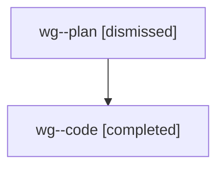

# Family: wg

[Agent Hoods](../README.md) / [bbugyi200](../users/bbugyi200/README.md) / [athena](../users/bbugyi200/machines/athena/README.md) / [wg](../users/bbugyi200/machines/athena/hoods/wg/README.md) / wg

Owner: `bbugyi200.athena` · Hood: `wg` · Members: 2

## Lineage

The diagram is an optional enhancement; the ordered table below contains the same lineage in accessible text.

| Role | Agent | State | Model / provider | Timing | Commits | Prompt | Chat |
|---|---|---|---|---|---:|---|---|
| plan | wg--plan | dismissed | opus / claude | 2026-08-09T09:02:26.014479 → 2026-08-09T09:37:25.768847 | 0 | — | [Chat](../agents/bbugyi200.athena.wg--plan/chat.md) |
| code | wg--code | completed | gpt-5.5 / codex | 2026-08-09T13:09:40.094929+00:00 | [1](../agents/bbugyi200.athena.wg--code/README.md#commits) | — | [Chat](../agents/bbugyi200.athena.wg--code/chat.md) |

## Commits

| Role | Repo | Commit | Subject | Committed |
|---|---|---|---|---|
| code | sase | [`8847140`](https://github.com/sase-org/sase/commit/8847140e9eeeff4b56e213c71b670bdd3a1b8d71) | fix(tui): normalize glossary preview field labels | 2026-08-09 13:35:42 UTC |
