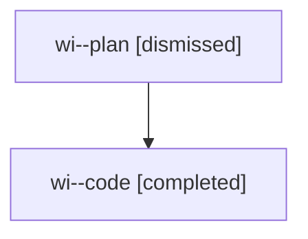

# Family: wi

[Agent Hoods](../README.md) / [bbugyi200](../users/bbugyi200/README.md) / [athena](../users/bbugyi200/machines/athena/README.md) / [wi](../users/bbugyi200/machines/athena/hoods/wi/README.md) / wi

Owner: `bbugyi200.athena` · Hood: `wi` · Members: 2

## Lineage

The diagram is an optional enhancement; the ordered table below contains the same lineage in accessible text.

| Role | Agent | State | Model / provider | Timing | Commits | Prompt | Chat |
|---|---|---|---|---|---:|---|---|
| plan | wi--plan | dismissed | opus / claude | 2026-08-09T09:09:32.204023 → 2026-08-09T09:59:05.478340 | 0 | — | [Chat](../agents/bbugyi200.athena.wi--plan/chat.md) |
| code | wi--code | completed | gpt-5.5 / codex | 2026-08-09T13:21:04.521376+00:00 | [1](../agents/bbugyi200.athena.wi--code/README.md#commits) | — | [Chat](../agents/bbugyi200.athena.wi--code/chat.md) |

## Commits

| Role | Repo | Commit | Subject | Committed |
|---|---|---|---|---|
| code | sase | [`957219e`](https://github.com/sase-org/sase/commit/957219ef24f2816db159d23a7517e83c9ab51592) | fix: honor terminal wait resolution outcomes | 2026-08-09 13:56:39 UTC |
