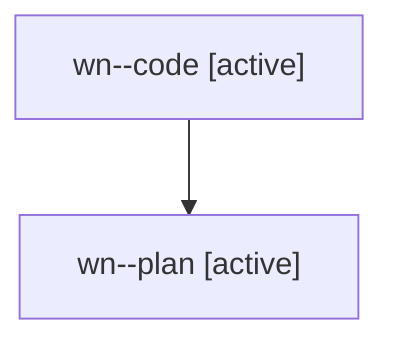

# Family: wn

[Agent Hoods](../README.md) / [bbugyi200](../users/bbugyi200/README.md) / [athena](../users/bbugyi200/machines/athena/README.md) / [wn](../users/bbugyi200/machines/athena/hoods/wn/README.md) / wn

Owner: `bbugyi200.athena` · Hood: `wn` · Members: 2

## Lineage

The diagram is an optional enhancement; the ordered table below contains the same lineage in accessible text.

| Role | Agent | State | Model / provider | Timing | Commits | Prompt | Chat |
|---|---|---|---|---|---:|---|---|
| code | wn--code | active | gpt-5.5 / codex | 2026-08-09T17:44:03.977720+00:00 | 0 | — | — |
| plan | wn--plan | active | opus / claude | 2026-08-09T17:35:12.539036+00:00 | 0 | [Prompt](../agents/bbugyi200.athena.wn--plan/prompt.md) | [Chat](../agents/bbugyi200.athena.wn--plan/chat.md) |
