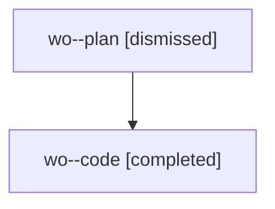

# Family: wo

[Agent Hoods](../README.md) / [bbugyi200](../users/bbugyi200/README.md) / [athena](../users/bbugyi200/machines/athena/README.md) / [wo](../users/bbugyi200/machines/athena/hoods/wo/README.md) / wo

Owner: `bbugyi200.athena` · Hood: `wo` · Members: 2

## Lineage

The diagram is an optional enhancement; the ordered table below contains the same lineage in accessible text.

| Role | Agent | State | Model / provider | Timing | Commits | Prompt | Chat |
|---|---|---|---|---|---:|---|---|
| plan | wo--plan | dismissed | opus / claude | 2026-08-09T13:37:32.898925 → 2026-08-09T14:45:17.193924 | 0 | — | [Chat](../agents/bbugyi200.athena.wo--plan/chat.md) |
| code | wo--code | completed | gpt-5.5 / codex | 2026-08-09T17:54:02.227467+00:00 | [1](../agents/bbugyi200.athena.wo--code/README.md#commits) | — | [Chat](../agents/bbugyi200.athena.wo--code/chat.md) |

## Commits

| Role | Repo | Commit | Subject | Committed |
|---|---|---|---|---|
| code | sase | [`f25a846`](https://github.com/sase-org/sase/commit/f25a84603f43a2048a766db83ae74a31b2a91526) | fix(ace): run post-write commands noninteractively | 2026-08-09 18:43:02 UTC |
