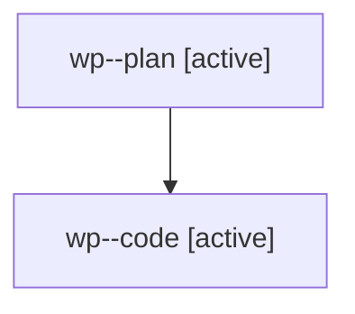

# Family: wp

[Agent Hoods](../README.md) / [bbugyi200](../users/bbugyi200/README.md) / [athena](../users/bbugyi200/machines/athena/README.md) / [wp](../users/bbugyi200/machines/athena/hoods/wp/README.md) / wp

Owner: `bbugyi200.athena` · Hood: `wp` · Members: 2

## Lineage

The diagram is an optional enhancement; the ordered table below contains the same lineage in accessible text.

| Role | Agent | State | Model / provider | Timing | Commits | Prompt | Chat |
|---|---|---|---|---|---:|---|---|
| plan | wp--plan | active | opus / claude | 2026-08-09T18:51:47.983814+00:00 | 0 | [Prompt](../agents/bbugyi200.athena.wp--plan/prompt.md) | [Chat](../agents/bbugyi200.athena.wp--plan/chat.md) |
| code | wp--code | active | gpt-5.5 / codex | 2026-08-09T18:59:38.506306+00:00 | [1](../agents/bbugyi200.athena.wp--code/README.md#commits) | — | — |

## Commits

| Role | Repo | Commit | Subject | Committed |
|---|---|---|---|---|
| code | sase | [`ee41f66`](https://github.com/sase-org/sase/commit/ee41f66ec4fe45fe31e66692479c697bc5be3efd) | fix(dev-update): pass complete envs to reconcile runners | 2026-08-09 15:20:01 EDT |
