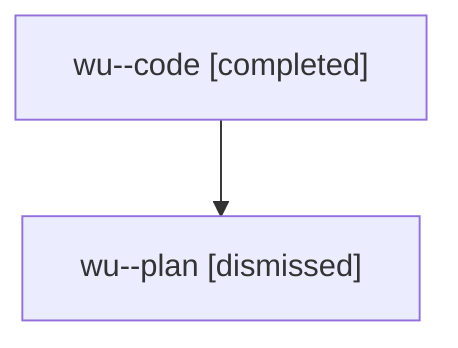

# Family: wu

[Agent Hoods](../README.md) / [bbugyi200](../users/bbugyi200/README.md) / [athena](../users/bbugyi200/machines/athena/README.md) / [wu](../users/bbugyi200/machines/athena/hoods/wu/README.md) / wu

Owner: `bbugyi200.athena` · Hood: `wu` · Members: 2

## Lineage

The diagram is an optional enhancement; the ordered table below contains the same lineage in accessible text.

| Role | Agent | State | Model / provider | Timing | Commits | Prompt | Chat |
|---|---|---|---|---|---:|---|---|
| code | wu--code | completed | gpt-5.5 / codex | 2026-08-09T21:01:52.791864+00:00 | [1](../agents/bbugyi200.athena.wu--code/README.md#commits) | — | [Chat](../agents/bbugyi200.athena.wu--code/chat.md) |
| plan | wu--plan | dismissed | opus / claude | 2026-08-09T16:47:25.233064 → 2026-08-09T17:57:04.829785 | 0 | — | [Chat](../agents/bbugyi200.athena.wu--plan/chat.md) |

## Commits

| Role | Repo | Commit | Subject | Committed |
|---|---|---|---|---|
| code | sase | [`59ea423`](https://github.com/sase-org/sase/commit/59ea423c6d0d851f300695eb457ad3c2b9e4ebce) | feat(bead): filter list by creation date | 2026-08-09 17:55:35 EDT |
