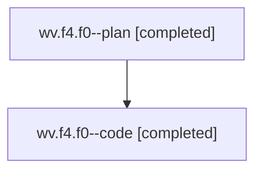

# Family: wv.f4.f0

[Agent Hoods](../README.md) / [bbugyi200](../users/bbugyi200/README.md) / [athena](../users/bbugyi200/machines/athena/README.md) / [wv](../users/bbugyi200/machines/athena/hoods/wv/README.md) / wv.f4.f0

Owner: `bbugyi200.athena` · Hood: `wv` · Members: 2

## Lineage

The diagram is an optional enhancement; the ordered table below contains the same lineage in accessible text.

| Role | Agent | State | Model / provider | Timing | Commits | Prompt | Chat |
|---|---|---|---|---|---:|---|---|
| plan | wv.f4.f0--plan | completed | opus / claude | 2026-08-10T17:07:01.199132+00:00 | 0 | [Prompt](../agents/bbugyi200.athena.wv.f4.f0--plan/prompt.md) | [Chat](../agents/bbugyi200.athena.wv.f4.f0--plan/chat.md) |
| code | wv.f4.f0--code | completed | sonnet / claude | 2026-08-10T17:15:05.046700+00:00 | [1](../agents/bbugyi200.athena.wv.f4.f0--code/README.md#commits) | — | [Chat](../agents/bbugyi200.athena.wv.f4.f0--code/chat.md) |

## Commits

| Role | Repo | Commit | Subject | Committed |
|---|---|---|---|---|
| code | sase | [`3420d12`](https://github.com/sase-org/sase/commit/3420d12113c623dbb517a1ae0917dcb2165383c1) | fix(ace): show shipped @smarter reference on default row's provenance tag | 2026-08-10 13:32:37 EDT |

## Neighbors

| Agent | Relation | State |
|---|---|---|
| [wv.f4](bbugyi200.athena.wv.f4.md) (family · 2) | ancestor | completed 2 |
| [wv](../agents/bbugyi200.athena.wv/README.md) | ancestor | dismissed |
| [wv.f0](../agents/bbugyi200.athena.wv.f0/README.md) | wv hood | dismissed |
| [wv.f1](../agents/bbugyi200.athena.wv.f1/README.md) | wv hood | waiting |
| [wv.f2](../agents/bbugyi200.athena.wv.f2/README.md) | wv hood | dismissed |
