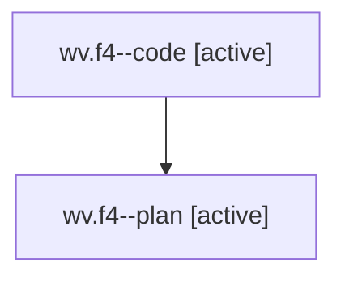

# Family: wv.f4

[Agent Hoods](../README.md) / [bbugyi200](../users/bbugyi200/README.md) / [athena](../users/bbugyi200/machines/athena/README.md) / [wv](../users/bbugyi200/machines/athena/hoods/wv/README.md) / wv.f4

Owner: `bbugyi200.athena` · Hood: `wv` · Members: 2

## Lineage

The diagram is an optional enhancement; the ordered table below contains the same lineage in accessible text.

| Role | Agent | State | Model / provider | Timing | Commits | Prompt | Chat |
|---|---|---|---|---|---:|---|---|
| code | wv.f4--code | active | gpt-5.5 / codex | 2026-08-10T16:00:29.742212+00:00 | [1](../agents/bbugyi200.athena.wv.f4--code/README.md#commits) | — | — |
| plan | wv.f4--plan | active | opus / claude | 2026-08-10T15:52:14.243540+00:00 | 0 | [Prompt](../agents/bbugyi200.athena.wv.f4--plan/prompt.md) | [Chat](../agents/bbugyi200.athena.wv.f4--plan/chat.md) |

## Commits

| Role | Repo | Commit | Subject | Committed |
|---|---|---|---|---|
| code | sase | [`012e1a8`](https://github.com/sase-org/sase/commit/012e1a88bc83cfa23e5505d791b149bc26d78765) | feat: add smarter model alias routing | 2026-08-10 13:02:12 EDT |

## Neighbors

| Agent | Relation | State |
|---|---|---|
| [wv](../agents/bbugyi200.athena.wv/README.md) | ancestor | dismissed |
| [wv.f0](../agents/bbugyi200.athena.wv.f0/README.md) | wv hood | dismissed |
| [wv.f1](../agents/bbugyi200.athena.wv.f1/README.md) | wv hood | dismissed |
| [wv.f2](../agents/bbugyi200.athena.wv.f2/README.md) | wv hood | dismissed |
