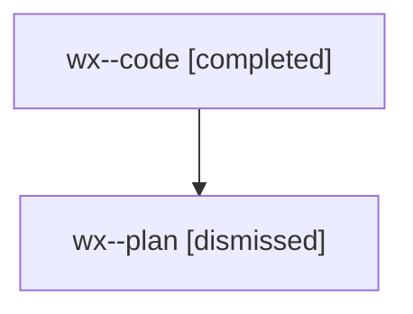

# Family: wx

[Agent Hoods](../README.md) / [bbugyi200](../users/bbugyi200/README.md) / [athena](../users/bbugyi200/machines/athena/README.md) / [wx](../users/bbugyi200/machines/athena/hoods/wx/README.md) / wx

Owner: `bbugyi200.athena` · Hood: `wx` · Members: 2

## Lineage

The diagram is an optional enhancement; the ordered table below contains the same lineage in accessible text.

| Role | Agent | State | Model / provider | Timing | Commits | Prompt | Chat |
|---|---|---|---|---|---:|---|---|
| code | wx--code | completed | gpt-5.5 / codex | 2026-08-10T13:18:15.263547+00:00 | [1](../agents/bbugyi200.athena.wx--code/README.md#commits) | — | [Chat](../agents/bbugyi200.athena.wx--code/chat.md) |
| plan | wx--plan | dismissed | opus / claude | 2026-08-10T09:09:46.487402 → 2026-08-10T10:04:27.030098 | 0 | — | [Chat](../agents/bbugyi200.athena.wx--plan/chat.md) |

## Commits

| Role | Repo | Commit | Subject | Committed |
|---|---|---|---|---|
| code | sase | [`0268357`](https://github.com/sase-org/sase/commit/0268357643563c622d70a45683817f80af47299c) | fix(tui): remove duplicate PR onboarding quickstart | 2026-08-10 10:03:14 EDT |
