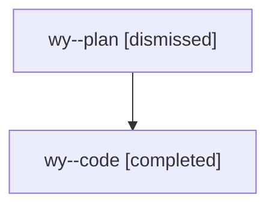

# Family: wy

[Agent Hoods](../README.md) / [bbugyi200](../users/bbugyi200/README.md) / [athena](../users/bbugyi200/machines/athena/README.md) / [wy](../users/bbugyi200/machines/athena/hoods/wy/README.md) / wy

Owner: `bbugyi200.athena` · Hood: `wy` · Members: 2

## Lineage

The diagram is an optional enhancement; the ordered table below contains the same lineage in accessible text.

| Role | Agent | State | Model / provider | Timing | Commits | Prompt | Chat |
|---|---|---|---|---|---:|---|---|
| plan | wy--plan | dismissed | opus / claude | 2026-08-10T09:19:58.685664 → 2026-08-10T09:53:21.969740 | 0 | — | [Chat](../agents/bbugyi200.athena.wy--plan/chat.md) |
| code | wy--code | completed | gpt-5.5 / codex | 2026-08-10T13:34:40.604580+00:00 | [1](../agents/bbugyi200.athena.wy--code/README.md#commits) | — | [Chat](../agents/bbugyi200.athena.wy--code/chat.md) |

## Commits

| Role | Repo | Commit | Subject | Committed |
|---|---|---|---|---|
| code | sase | [`92b8281`](https://github.com/sase-org/sase/commit/92b82819c88428c3953f0e83397253757d87a7b3) | fix: defer task triage while launch is active | 2026-08-10 13:51:28 UTC |
