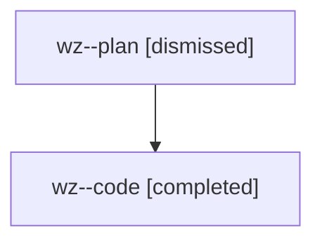

# Family: wz

[Agent Hoods](../README.md) / [bbugyi200](../users/bbugyi200/README.md) / [athena](../users/bbugyi200/machines/athena/README.md) / [wz](../users/bbugyi200/machines/athena/hoods/wz/README.md) / wz

Owner: `bbugyi200.athena` · Hood: `wz` · Members: 2

## Lineage

The diagram is an optional enhancement; the ordered table below contains the same lineage in accessible text.

| Role | Agent | State | Model / provider | Timing | Commits | Prompt | Chat |
|---|---|---|---|---|---:|---|---|
| plan | wz--plan | dismissed | opus / claude | 2026-08-10T09:26:25.248617 → 2026-08-10T10:23:07.450839 | 0 | — | [Chat](../agents/bbugyi200.athena.wz--plan/chat.md) |
| code | wz--code | completed | gpt-5.5 / codex | 2026-08-10T13:40:56.612002+00:00 | [1](../agents/bbugyi200.athena.wz--code/README.md#commits) | — | [Chat](../agents/bbugyi200.athena.wz--code/chat.md) |

## Commits

| Role | Repo | Commit | Subject | Committed |
|---|---|---|---|---|
| code | sase | [`4b89140`](https://github.com/sase-org/sase/commit/4b891406b86f7d7fdb4536cc89b131955da9ffeb) | feat(bead): show task sizes in compact listings | 2026-08-10 10:21:23 EDT |
