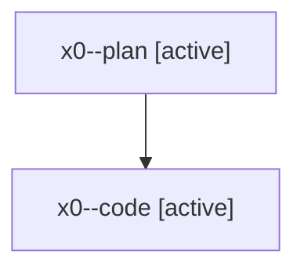

# Family: x0

[Agent Hoods](../README.md) / [bbugyi200](../users/bbugyi200/README.md) / [athena](../users/bbugyi200/machines/athena/README.md) / [x0](../users/bbugyi200/machines/athena/hoods/x0/README.md) / x0

Owner: `bbugyi200.athena` · Hood: `x0` · Members: 2

## Lineage

The diagram is an optional enhancement; the ordered table below contains the same lineage in accessible text.

| Role | Agent | State | Model / provider | Timing | Commits | Prompt | Chat |
|---|---|---|---|---|---:|---|---|
| plan | x0--plan | active | opus / claude | 2026-08-10T13:41:27.122846+00:00 | 0 | [Prompt](../agents/bbugyi200.athena.x0--plan/prompt.md) | [Chat](../agents/bbugyi200.athena.x0--plan/chat.md) |
| code | x0--code | active | gpt-5.5 / codex | 2026-08-10T13:46:12.039836+00:00 | [1](../agents/bbugyi200.athena.x0--code/README.md#commits) | — | — |

## Commits

| Role | Repo | Commit | Subject | Committed |
|---|---|---|---|---|
| code | sase | [`0d3d2f9`](https://github.com/sase-org/sase/commit/0d3d2f9b0ce6a494066365952c8332c5b52e3a9a) | fix: stop task launches from forcing commit rollover | 2026-08-10 10:52:56 EDT |
