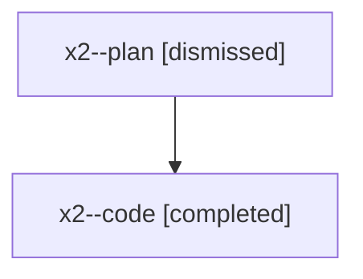

# Family: x2

[Agent Hoods](../README.md) / [bbugyi200](../users/bbugyi200/README.md) / [athena](../users/bbugyi200/machines/athena/README.md) / [x2](../users/bbugyi200/machines/athena/hoods/x2/README.md) / x2

Owner: `bbugyi200.athena` · Hood: `x2` · Members: 2

## Lineage

The diagram is an optional enhancement; the ordered table below contains the same lineage in accessible text.

| Role | Agent | State | Model / provider | Timing | Commits | Prompt | Chat |
|---|---|---|---|---|---:|---|---|
| plan | x2--plan | dismissed | opus / claude | 2026-08-10T09:45:06.814030 → 2026-08-10T10:35:53.053739 | 0 | — | [Chat](../agents/bbugyi200.athena.x2--plan/chat.md) |
| code | x2--code | completed | gpt-5.5 / codex | 2026-08-10T13:59:56.130370+00:00 | [1](../agents/bbugyi200.athena.x2--code/README.md#commits) | — | [Chat](../agents/bbugyi200.athena.x2--code/chat.md) |

## Commits

| Role | Repo | Commit | Subject | Committed |
|---|---|---|---|---|
| code | sase | [`fb7b836`](https://github.com/sase-org/sase/commit/fb7b8366e4960081593235d66a7e73886f50d9fc) | fix(runner-slots): order queue display by capacity | 2026-08-10 14:34:19 UTC |
