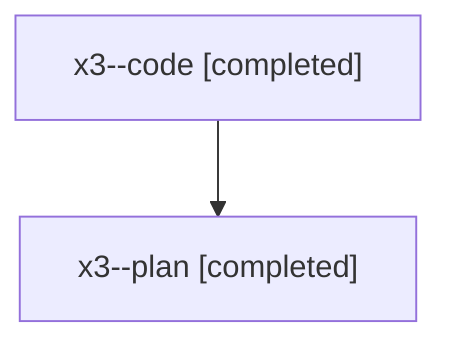

# Family: x3

[Agent Hoods](../README.md) / [bbugyi200](../users/bbugyi200/README.md) / [athena](../users/bbugyi200/machines/athena/README.md) / [x3](../users/bbugyi200/machines/athena/hoods/x3/README.md) / x3

Owner: `bbugyi200.athena` · Hood: `x3` · Members: 2

## Lineage

The diagram is an optional enhancement; the ordered table below contains the same lineage in accessible text.

| Role | Agent | State | Model / provider | Timing | Commits | Prompt | Chat |
|---|---|---|---|---|---:|---|---|
| code | x3--code | completed | gpt-5.5 / codex | 2026-08-10T14:02:01.928755+00:00 | [1](../agents/bbugyi200.athena.x3--code/README.md#commits) | — | [Chat](../agents/bbugyi200.athena.x3--code/chat.md) |
| plan | x3--plan | completed | opus / claude | 2026-08-10T13:53:31.032026+00:00 | 0 | [Prompt](../agents/bbugyi200.athena.x3--plan/prompt.md) | [Chat](../agents/bbugyi200.athena.x3--plan/chat.md) |

## Commits

| Role | Repo | Commit | Subject | Committed |
|---|---|---|---|---|
| code | sase | [`ba3791f`](https://github.com/sase-org/sase/commit/ba3791f1e7873dc1cb573021fbba86ef10ac4648) | feat(ace): resolve notification tab icon collisions | 2026-08-10 10:46:57 EDT |
