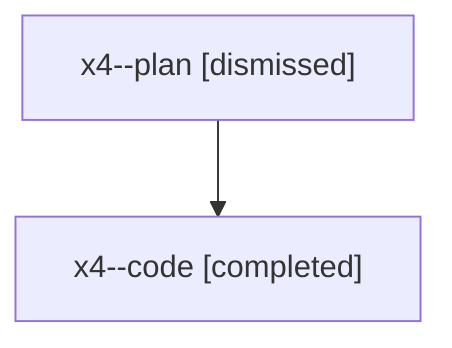

# Family: x4

[Agent Hoods](../README.md) / [bbugyi200](../users/bbugyi200/README.md) / [athena](../users/bbugyi200/machines/athena/README.md) / [x4](../users/bbugyi200/machines/athena/hoods/x4/README.md) / x4

Owner: `bbugyi200.athena` · Hood: `x4` · Members: 2

## Lineage

The diagram is an optional enhancement; the ordered table below contains the same lineage in accessible text.

| Role | Agent | State | Model / provider | Timing | Commits | Prompt | Chat |
|---|---|---|---|---|---:|---|---|
| plan | x4--plan | dismissed | opus / claude | 2026-08-10T10:04:34.888945 → 2026-08-10T10:25:28.929371 | 0 | — | [Chat](../agents/bbugyi200.athena.x4--plan/chat.md) |
| code | x4--code | completed | gpt-5.5 / codex | 2026-08-10T14:14:25.201943+00:00 | [1](../agents/bbugyi200.athena.x4--code/README.md#commits) | — | [Chat](../agents/bbugyi200.athena.x4--code/chat.md) |

## Commits

| Role | Repo | Commit | Subject | Committed |
|---|---|---|---|---|
| code | sase | [`7c22405`](https://github.com/sase-org/sase/commit/7c224059c562d4f45aa58f1fb5f44019be24ab5e) | feat(plan): associate proposals from task beads | 2026-08-10 14:24:31 UTC |
