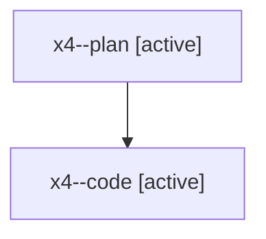

# Family: x4

[Agent Hoods](../README.md) / [bbugyi200](../users/bbugyi200/README.md) / [athena](../users/bbugyi200/machines/athena/README.md) / [x4](../users/bbugyi200/machines/athena/hoods/x4/README.md) / x4

Owner: `bbugyi200.athena` · Hood: `x4` · Members: 2

## Lineage

The diagram is an optional enhancement; the ordered table below contains the same lineage in accessible text.

| Role | Agent | State | Model / provider | Timing | Commits | Prompt | Chat |
|---|---|---|---|---|---:|---|---|
| plan | x4--plan | active | opus / claude | 2026-08-10T14:04:34.888945+00:00 | 0 | [Prompt](../agents/bbugyi200.athena.x4--plan/prompt.md) | [Chat](../agents/bbugyi200.athena.x4--plan/chat.md) |
| code | x4--code | active | gpt-5.5 / codex | 2026-08-10T14:14:25.201943+00:00 | 0 | — | — |
