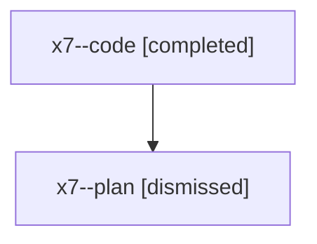

# Family: x7

[Agent Hoods](../README.md) / [bbugyi200](../users/bbugyi200/README.md) / [athena](../users/bbugyi200/machines/athena/README.md) / [x7](../users/bbugyi200/machines/athena/hoods/x7/README.md) / x7

Owner: `bbugyi200.athena` · Hood: `x7` · Members: 2

## Lineage

The diagram is an optional enhancement; the ordered table below contains the same lineage in accessible text.

| Role | Agent | State | Model / provider | Timing | Commits | Prompt | Chat |
|---|---|---|---|---|---:|---|---|
| code | x7--code | completed | gpt-5.5 / codex | 2026-08-10T14:35:50.148116+00:00 | [1](../agents/bbugyi200.athena.x7--code/README.md#commits) | — | [Chat](../agents/bbugyi200.athena.x7--code/chat.md) |
| plan | x7--plan | dismissed | opus / claude | 2026-08-10T10:23:11.275692 → 2026-08-10T11:26:36.164741 | 0 | — | [Chat](../agents/bbugyi200.athena.x7--plan/chat.md) |

## Commits

| Role | Repo | Commit | Subject | Committed |
|---|---|---|---|---|
| code | sase | [`168fd20`](https://github.com/sase-org/sase/commit/168fd208bf343a7757e4b70193cc5cf43a78b612) | feat(ace): reset tribe panel folds on rebirth | 2026-08-10 15:25:34 UTC |
