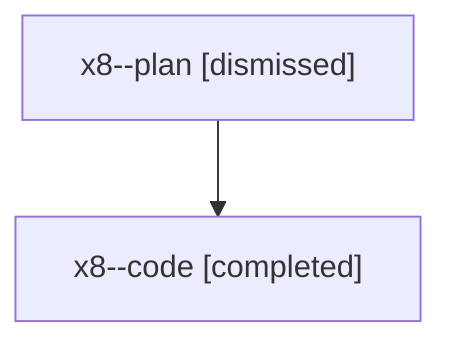

# Family: x8

[Agent Hoods](../README.md) / [bbugyi200](../users/bbugyi200/README.md) / [athena](../users/bbugyi200/machines/athena/README.md) / [x8](../users/bbugyi200/machines/athena/hoods/x8/README.md) / x8

Owner: `bbugyi200.athena` · Hood: `x8` · Members: 2

## Lineage

The diagram is an optional enhancement; the ordered table below contains the same lineage in accessible text.

| Role | Agent | State | Model / provider | Timing | Commits | Prompt | Chat |
|---|---|---|---|---|---:|---|---|
| plan | x8--plan | dismissed | opus / claude | 2026-08-10T10:25:58.451482 → 2026-08-10T11:11:29.735003 | 0 | — | [Chat](../agents/bbugyi200.athena.x8--plan/chat.md) |
| code | x8--code | completed | gpt-5.5 / codex | 2026-08-10T14:39:06.135169+00:00 | [1](../agents/bbugyi200.athena.x8--code/README.md#commits) | — | [Chat](../agents/bbugyi200.athena.x8--code/chat.md) |

## Commits

| Role | Repo | Commit | Subject | Committed |
|---|---|---|---|---|
| code | sase | [`a9770ee`](https://github.com/sase-org/sase/commit/a9770ee1937e2bab0f9c02fc1b40dd9fa9fdb3f3) | feat(tui): fold verbose BEAD detail rows | 2026-08-10 11:02:32 EDT |
