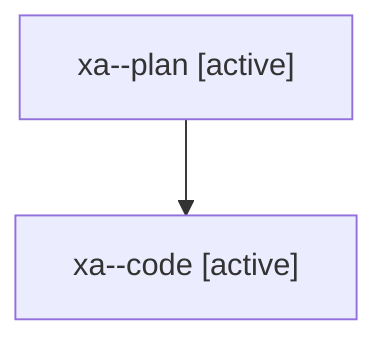

# Family: xa

[Agent Hoods](../README.md) / [bbugyi200](../users/bbugyi200/README.md) / [athena](../users/bbugyi200/machines/athena/README.md) / [xa](../users/bbugyi200/machines/athena/hoods/xa/README.md) / xa

Owner: `bbugyi200.athena` · Hood: `xa` · Members: 2

## Lineage

The diagram is an optional enhancement; the ordered table below contains the same lineage in accessible text.

| Role | Agent | State | Model / provider | Timing | Commits | Prompt | Chat |
|---|---|---|---|---|---:|---|---|
| plan | xa--plan | active | opus / claude | 2026-08-10T14:35:29.745131+00:00 | 0 | [Prompt](../agents/bbugyi200.athena.xa--plan/prompt.md) | [Chat](../agents/bbugyi200.athena.xa--plan/chat.md) |
| code | xa--code | active | gpt-5.5 / codex | 2026-08-10T14:46:06.065078+00:00 | 0 | — | — |
