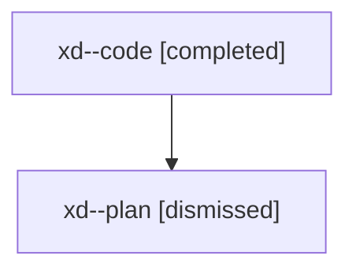

# Family: xd

[Agent Hoods](../README.md) / [bbugyi200](../users/bbugyi200/README.md) / [athena](../users/bbugyi200/machines/athena/README.md) / [xd](../users/bbugyi200/machines/athena/hoods/xd/README.md) / xd

Owner: `bbugyi200.athena` · Hood: `xd` · Members: 2

## Lineage

The diagram is an optional enhancement; the ordered table below contains the same lineage in accessible text.

| Role | Agent | State | Model / provider | Timing | Commits | Prompt | Chat |
|---|---|---|---|---|---:|---|---|
| code | xd--code | completed | gpt-5.5 / codex | 2026-08-10T16:57:44.095468+00:00 | [1](../agents/bbugyi200.athena.xd--code/README.md#commits) | — | [Chat](../agents/bbugyi200.athena.xd--code/chat.md) |
| plan | xd--plan | dismissed | opus / claude | 2026-08-10T12:54:57.261000 → 2026-08-10T13:30:37.598446 | 0 | — | [Chat](../agents/bbugyi200.athena.xd--plan/chat.md) |

## Commits

| Role | Repo | Commit | Subject | Committed |
|---|---|---|---|---|
| code | sase | [`24dde37`](https://github.com/sase-org/sase/commit/24dde377599fa0bdcec8207663fdd11517e87204) | docs: drop plan authoring size paragraph | 2026-08-10 17:28:30 UTC |
