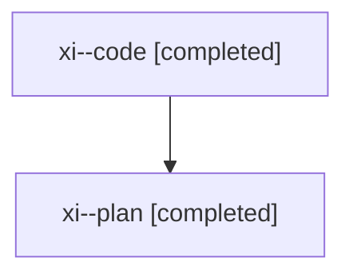

# Family: xi

[Agent Hoods](../README.md) / [bbugyi200](../users/bbugyi200/README.md) / [athena](../users/bbugyi200/machines/athena/README.md) / [xi](../users/bbugyi200/machines/athena/hoods/xi/README.md) / xi

Owner: `bbugyi200.athena` · Hood: `xi` · Members: 2

## Lineage

The diagram is an optional enhancement; the ordered table below contains the same lineage in accessible text.

| Role | Agent | State | Model / provider | Timing | Commits | Prompt | Chat |
|---|---|---|---|---|---:|---|---|
| code | xi--code | completed | gpt-5.5 / codex | 2026-08-10T18:11:05.778246+00:00 | [1](../agents/bbugyi200.athena.xi--code/README.md#commits) | — | [Chat](../agents/bbugyi200.athena.xi--code/chat.md) |
| plan | xi--plan | completed | opus / claude | 2026-08-10T18:05:14.081812+00:00 | 0 | [Prompt](../agents/bbugyi200.athena.xi--plan/prompt.md) | [Chat](../agents/bbugyi200.athena.xi--plan/chat.md) |

## Commits

| Role | Repo | Commit | Subject | Committed |
|---|---|---|---|---|
| code | sase | [`14279fd`](https://github.com/sase-org/sase/commit/14279fd90f42dc36560601650775cc6da3da7f9b) | fix(ace): render plan lane above bead context | 2026-08-10 14:41:35 EDT |
