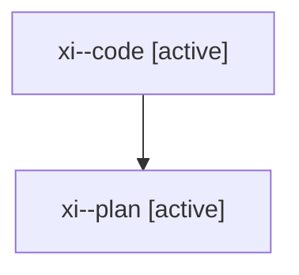

# Family: xi

[Agent Hoods](../README.md) / [bbugyi200](../users/bbugyi200/README.md) / [athena](../users/bbugyi200/machines/athena/README.md) / [xi](../users/bbugyi200/machines/athena/hoods/xi/README.md) / xi

Owner: `bbugyi200.athena` · Hood: `xi` · Members: 2

## Lineage

The diagram is an optional enhancement; the ordered table below contains the same lineage in accessible text.

| Role | Agent | State | Model / provider | Timing | Commits | Prompt | Chat |
|---|---|---|---|---|---:|---|---|
| code | xi--code | active | gpt-5.5 / codex | 2026-08-10T18:11:05.778246+00:00 | 0 | — | — |
| plan | xi--plan | active | opus / claude | 2026-08-10T18:05:14.081812+00:00 | 0 | [Prompt](../agents/bbugyi200.athena.xi--plan/prompt.md) | [Chat](../agents/bbugyi200.athena.xi--plan/chat.md) |
