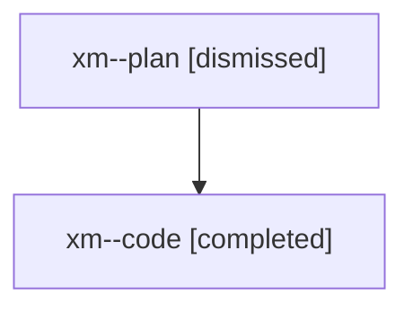

# Family: xm

[Agent Hoods](../README.md) / [bbugyi200](../users/bbugyi200/README.md) / [athena](../users/bbugyi200/machines/athena/README.md) / [xm](../users/bbugyi200/machines/athena/hoods/xm/README.md) / xm

Owner: `bbugyi200.athena` · Hood: `xm` · Members: 2

## Lineage

The diagram is an optional enhancement; the ordered table below contains the same lineage in accessible text.

| Role | Agent | State | Model / provider | Timing | Commits | Prompt | Chat |
|---|---|---|---|---|---:|---|---|
| plan | xm--plan | dismissed | opus / claude | 2026-08-10T15:31:55.114899 → 2026-08-10T16:52:12.696468 | 0 | — | [Chat](../agents/bbugyi200.athena.xm--plan/chat.md) |
| code | xm--code | completed | gpt-5.5 / codex | 2026-08-10T19:44:51.007290+00:00 | [1](../agents/bbugyi200.athena.xm--code/README.md#commits) | — | [Chat](../agents/bbugyi200.athena.xm--code/chat.md) |

## Commits

| Role | Repo | Commit | Subject | Committed |
|---|---|---|---|---|
| code | sase | [`37bbaa7`](https://github.com/sase-org/sase/commit/37bbaa7699d221a582ef09c5f683fad0e25d26d5) | feat: show model alias provenance in model labels | 2026-08-10 16:50:31 EDT |
