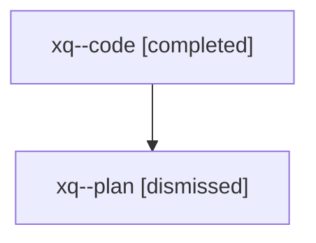

# Family: xq

[Agent Hoods](../README.md) / [bbugyi200](../users/bbugyi200/README.md) / [athena](../users/bbugyi200/machines/athena/README.md) / [xq](../users/bbugyi200/machines/athena/hoods/xq/README.md) / xq

Owner: `bbugyi200.athena` · Hood: `xq` · Members: 2

## Lineage

The diagram is an optional enhancement; the ordered table below contains the same lineage in accessible text.

| Role | Agent | State | Model / provider | Timing | Commits | Prompt | Chat |
|---|---|---|---|---|---:|---|---|
| code | xq--code | completed | sonnet / claude | 2026-08-10T23:19:26.385463+00:00 | [1](../agents/bbugyi200.athena.xq--code/README.md#commits) | — | [Chat](../agents/bbugyi200.athena.xq--code/chat.md) |
| plan | xq--plan | dismissed | opus / claude | 2026-08-10T19:08:03.282558 → 2026-08-10T19:57:49.525205 | 0 | — | [Chat](../agents/bbugyi200.athena.xq--plan/chat.md) |

## Commits

| Role | Repo | Commit | Subject | Committed |
|---|---|---|---|---|
| code | sase | [`2c06b50`](https://github.com/sase-org/sase/commit/2c06b50a9f49a9634cd108d688d4023b90677f84) | feat(cli): add \`sase stitch create\` as canonical commit dispatch command | 2026-08-10 23:56:28 UTC |
