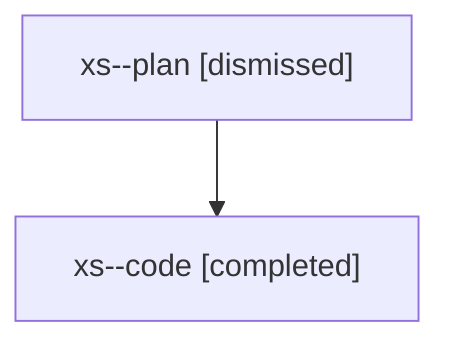

# Family: xs

[Agent Hoods](../README.md) / [bbugyi200](../users/bbugyi200/README.md) / [athena](../users/bbugyi200/machines/athena/README.md) / [xs](../users/bbugyi200/machines/athena/hoods/xs/README.md) / xs

Owner: `bbugyi200.athena` · Hood: `xs` · Members: 2

## Lineage

The diagram is an optional enhancement; the ordered table below contains the same lineage in accessible text.

| Role | Agent | State | Model / provider | Timing | Commits | Prompt | Chat |
|---|---|---|---|---|---:|---|---|
| plan | xs--plan | dismissed | opus / claude | 2026-08-11T06:17:55.838182 → 2026-08-11T07:48:25.392243 | 0 | — | [Chat](../agents/bbugyi200.athena.xs--plan/chat.md) |
| code | xs--code | completed | sonnet / claude | 2026-08-11T10:29:04.743891+00:00 | [1](../agents/bbugyi200.athena.xs--code/README.md#commits) | — | [Chat](../agents/bbugyi200.athena.xs--code/chat.md) |

## Commits

| Role | Repo | Commit | Subject | Committed |
|---|---|---|---|---|
| code | sase | [`ab3eebe`](https://github.com/sase-org/sase/commit/ab3eebed59aa797570912120e68ae4e309c3473f) | feat(ace): make Wait panel beads editable with completion and verification | 2026-08-11 07:47:39 EDT |
