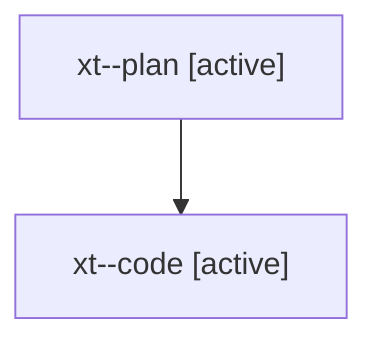

# Family: xt

[Agent Hoods](../README.md) / [bbugyi200](../users/bbugyi200/README.md) / [athena](../users/bbugyi200/machines/athena/README.md) / [xt](../users/bbugyi200/machines/athena/hoods/xt/README.md) / xt

Owner: `bbugyi200.athena` · Hood: `xt` · Members: 2

## Lineage

The diagram is an optional enhancement; the ordered table below contains the same lineage in accessible text.

| Role | Agent | State | Model / provider | Timing | Commits | Prompt | Chat |
|---|---|---|---|---|---:|---|---|
| plan | xt--plan | active | opus / claude | 2026-08-11T10:32:36.982135+00:00 | 0 | [Prompt](../agents/bbugyi200.athena.xt--plan/prompt.md) | [Chat](../agents/bbugyi200.athena.xt--plan/chat.md) |
| code | xt--code | active | gpt-5.5 / codex | 2026-08-11T10:40:44.373205+00:00 | 0 | — | — |
