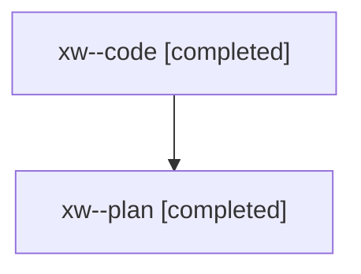

# Family: xw

[Agent Hoods](../README.md) / [bbugyi200](../users/bbugyi200/README.md) / [athena](../users/bbugyi200/machines/athena/README.md) / [xw](../users/bbugyi200/machines/athena/hoods/xw/README.md) / xw

Owner: `bbugyi200.athena` · Hood: `xw` · Members: 2

## Lineage

The diagram is an optional enhancement; the ordered table below contains the same lineage in accessible text.

| Role | Agent | State | Model / provider | Timing | Commits | Prompt | Chat |
|---|---|---|---|---|---:|---|---|
| code | xw--code | completed | sonnet / claude | 2026-08-11T11:27:34.937495+00:00 | [1](../agents/bbugyi200.athena.xw--code/README.md#commits) | — | [Chat](../agents/bbugyi200.athena.xw--code/chat.md) |
| plan | xw--plan | completed | opus / claude | 2026-08-11T11:20:08.741449+00:00 | 0 | [Prompt](../agents/bbugyi200.athena.xw--plan/prompt.md) | [Chat](../agents/bbugyi200.athena.xw--plan/chat.md) |

## Commits

| Role | Repo | Commit | Subject | Committed |
|---|---|---|---|---|
| code | sase | [`a3995e1`](https://github.com/sase-org/sase/commit/a3995e1cbe47ce1a23536e35ec4e3384cf16d513) | feat(ace): add vim \*/# word-under-cursor search to prompt input | 2026-08-11 08:14:21 EDT |
