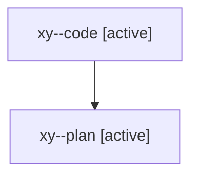

# Family: xy

[Agent Hoods](../README.md) / [bbugyi200](../users/bbugyi200/README.md) / [athena](../users/bbugyi200/machines/athena/README.md) / [xy](../users/bbugyi200/machines/athena/hoods/xy/README.md) / xy

Owner: `bbugyi200.athena` · Hood: `xy` · Members: 2

## Lineage

The diagram is an optional enhancement; the ordered table below contains the same lineage in accessible text.

| Role | Agent | State | Model / provider | Timing | Commits | Prompt | Chat |
|---|---|---|---|---|---:|---|---|
| code | xy--code | active | gpt-5.5 / codex | 2026-08-11T12:27:44.654207+00:00 | [2](../agents/bbugyi200.athena.xy--code/README.md#commits) | — | — |
| plan | xy--plan | active | opus / claude | 2026-08-11T12:19:38.965084+00:00 | 0 | [Prompt](../agents/bbugyi200.athena.xy--plan/prompt.md) | [Chat](../agents/bbugyi200.athena.xy--plan/chat.md) |

## Commits

| Role | Repo | Commit | Subject | Committed |
|---|---|---|---|---|
| code | sase | [`560f9b3`](https://github.com/sase-org/sase/commit/560f9b3326cb8e20d3b82fccfe614ce5452eb15f) | chore(tests): retire stale flake baseline debt | 2026-08-11 08:31:34 EDT |
| code | sase | [`c388b56`](https://github.com/sase-org/sase/commit/c388b560cfc3b0a2ae5f5abce693c837cd2cd292) | style(tests): format external mirror issue assertions | 2026-08-11 08:32:51 EDT |
