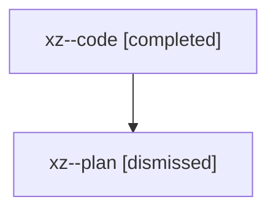

# Family: xz

[Agent Hoods](../README.md) / [bbugyi200](../users/bbugyi200/README.md) / [athena](../users/bbugyi200/machines/athena/README.md) / [xz](../users/bbugyi200/machines/athena/hoods/xz/README.md) / xz

Owner: `bbugyi200.athena` · Hood: `xz` · Members: 2

## Lineage

The diagram is an optional enhancement; the ordered table below contains the same lineage in accessible text.

| Role | Agent | State | Model / provider | Timing | Commits | Prompt | Chat |
|---|---|---|---|---|---:|---|---|
| code | xz--code | completed | gpt-5.5 / codex | 2026-08-11T12:39:32.306620+00:00 | [1](../agents/bbugyi200.athena.xz--code/README.md#commits) | — | [Chat](../agents/bbugyi200.athena.xz--code/chat.md) |
| plan | xz--plan | dismissed | opus / claude | 2026-08-11T08:30:02.316316 → 2026-08-11T09:20:45.080273 | 0 | — | [Chat](../agents/bbugyi200.athena.xz--plan/chat.md) |

## Commits

| Role | Repo | Commit | Subject | Committed |
|---|---|---|---|---|
| code | sase | [`3e19e7c`](https://github.com/sase-org/sase/commit/3e19e7cd15c71a2eacaa95fb5bb265a0c89c7b1f) | feat(ace): show fold restore preview markers | 2026-08-11 13:19:08 UTC |
