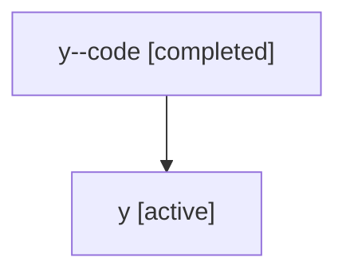

# Family: y

Owner: `bbugyi200.athena` · Hood: `y` · Members: 2

## Lineage

The diagram is an optional enhancement; the ordered table below contains the same lineage in accessible text.

| Role | Agent | State | Model / provider | Timing | Commits | Prompt | Chat |
|---|---|---|---|---|---:|---|---|
| code | y--code | completed | gpt-5.5 / codex | 2026-07-07T02:41:11.708916+00:00 | 0 | — | [Chat](../agents/bbugyi200.athena.y--code/chat.md) |
| root | y | active | claude-fable-5 / claude | 2026-07-07T02:26:49.684684+00:00 | 4 | [Prompt](../agents/bbugyi200.athena.y/prompt.md) | [Chat](../agents/bbugyi200.athena.y/chat.md) |
