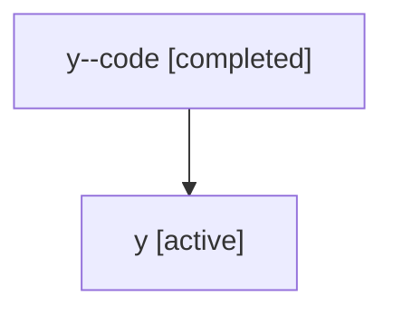

# Family: y

[Agent Hoods](../README.md) / [bbugyi200](../users/bbugyi200/README.md) / [athena](../users/bbugyi200/machines/athena/README.md) / [y](../users/bbugyi200/machines/athena/hoods/y/README.md) / y

Owner: `bbugyi200.athena` · Hood: `y` · Members: 2

## Lineage

The diagram is an optional enhancement; the ordered table below contains the same lineage in accessible text.

| Role | Agent | State | Model / provider | Timing | Commits | Prompt | Chat |
|---|---|---|---|---|---:|---|---|
| code | y--code | completed | gpt-5.5 / codex | 2026-07-07T02:41:11.708916+00:00 | [1](../agents/bbugyi200.athena.y--code/README.md#commits) | — | [Chat](../agents/bbugyi200.athena.y--code/chat.md) |
| root | y | active | claude-fable-5 / claude | 2026-07-07T02:26:49.684684+00:00 | [1](../agents/bbugyi200.athena.y/README.md#commits) | [Prompt](../agents/bbugyi200.athena.y/prompt.md) | [Chat](../agents/bbugyi200.athena.y/chat.md) |

## Commits

| Role | Repo | Commit | Subject | Committed |
|---|---|---|---|---|
| — | sase | [`4add66d`](https://github.com/sase-org/sase/commit/4add66de85c2b06c5d38f9321a3ab0c65425f8d2) | chore: Add SDD prompt and plan for tui\_title\_version | 2026-07-03 18:43:19 UTC |
| — | sase | [`9deb012`](https://github.com/sase-org/sase/commit/9deb01206b0de988b6de7827e4ff6253631f0bc8) | feat(ace): show sase version instead of PID in the TUI title | 2026-07-03 19:40:55 UTC |
| root | sase | [`8b64dd4`](https://github.com/sase-org/sase/commit/8b64dd4b635acd86924fea5873cd723eb9bb7fbf) | chore: Add SDD prompt and plan for sase\_run\_skill\_prompt\_guidance | 2026-07-07 02:41:10 UTC |
| code | sase | [`2894fd2`](https://github.com/sase-org/sase/commit/2894fd280cc76debdc012de6a77ade37dc85b121) | docs: clarify sase\_run prompt composition | 2026-07-07 02:48:00 UTC |
