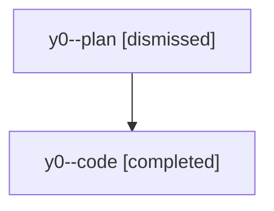

# Family: y0

[Agent Hoods](../README.md) / [bbugyi200](../users/bbugyi200/README.md) / [athena](../users/bbugyi200/machines/athena/README.md) / [y0](../users/bbugyi200/machines/athena/hoods/y0/README.md) / y0

Owner: `bbugyi200.athena` · Hood: `y0` · Members: 2

## Lineage

The diagram is an optional enhancement; the ordered table below contains the same lineage in accessible text.

| Role | Agent | State | Model / provider | Timing | Commits | Prompt | Chat |
|---|---|---|---|---|---:|---|---|
| plan | y0--plan | dismissed | opus / claude | 2026-08-11T09:32:05.889167 → 2026-08-11T09:51:32.549400 | 0 | — | [Chat](../agents/bbugyi200.athena.y0--plan/chat.md) |
| code | y0--code | completed | sonnet / claude | 2026-08-11T13:41:37.044818+00:00 | [1](../agents/bbugyi200.athena.y0--code/README.md#commits) | — | [Chat](../agents/bbugyi200.athena.y0--code/chat.md) |

## Commits

| Role | Repo | Commit | Subject | Committed |
|---|---|---|---|---|
| code | sase | [`f579dee`](https://github.com/sase-org/sase/commit/f579dee09d1eba09a8ed40828857ec780f8a456a) | fix(ace): stop clan summary panel crashing on unrenderable markup tags | 2026-08-11 13:50:05 UTC |
