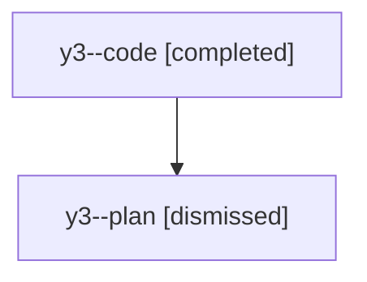

# Family: y3

[Agent Hoods](../README.md) / [bbugyi200](../users/bbugyi200/README.md) / [athena](../users/bbugyi200/machines/athena/README.md) / [y3](../users/bbugyi200/machines/athena/hoods/y3/README.md) / y3

Owner: `bbugyi200.athena` · Hood: `y3` · Members: 2

## Lineage

The diagram is an optional enhancement; the ordered table below contains the same lineage in accessible text.

| Role | Agent | State | Model / provider | Timing | Commits | Prompt | Chat |
|---|---|---|---|---|---:|---|---|
| code | y3--code | completed | gpt-5.5 / codex | 2026-08-11T18:45:34.394526+00:00 | [1](../agents/bbugyi200.athena.y3--code/README.md#commits) | — | [Chat](../agents/bbugyi200.athena.y3--code/chat.md) |
| plan | y3--plan | dismissed | gpt-5.6-sol / codex | 2026-08-11T14:39:16.185653 → 2026-08-11T15:06:10.772169 | 0 | — | [Chat](../agents/bbugyi200.athena.y3--plan/chat.md) |

## Commits

| Role | Repo | Commit | Subject | Committed |
|---|---|---|---|---|
| code | sase | [`19f8273`](https://github.com/sase-org/sase/commit/19f82733248902bffe4972afdfb2f780561d58ce) | test: stabilize CI alias availability expectation | 2026-08-11 19:03:49 UTC |
