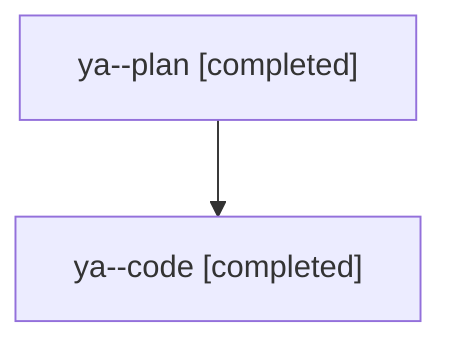

# Family: ya

[Agent Hoods](../README.md) / [bbugyi200](../users/bbugyi200/README.md) / [athena](../users/bbugyi200/machines/athena/README.md) / [ya](../users/bbugyi200/machines/athena/hoods/ya/README.md) / ya

Owner: `bbugyi200.athena` · Hood: `ya` · Members: 2

## Lineage

The diagram is an optional enhancement; the ordered table below contains the same lineage in accessible text.

| Role | Agent | State | Model / provider | Timing | Commits | Prompt | Chat |
|---|---|---|---|---|---:|---|---|
| plan | ya--plan | completed | opus / claude | 2026-08-12T11:38:18.274617+00:00 | 0 | [Prompt](../agents/bbugyi200.athena.ya--plan/prompt.md) | [Chat](../agents/bbugyi200.athena.ya--plan/chat.md) |
| code | ya--code | completed | sonnet / claude | 2026-08-12T11:50:42.070281+00:00 | [1](../agents/bbugyi200.athena.ya--code/README.md#commits) | — | [Chat](../agents/bbugyi200.athena.ya--code/chat.md) |

## Commits

| Role | Repo | Commit | Subject | Committed |
|---|---|---|---|---|
| code | sase | [`09e5fc4`](https://github.com/sase-org/sase/commit/09e5fc43e7dc2209c25145aa239d89519bfe63eb) | feat(ace): show plan tier and epic phase/wave/size counts in approval toasts | 2026-08-12 08:26:18 EDT |
