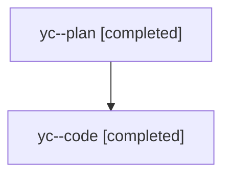

# Family: yc

[Agent Hoods](../README.md) / [bbugyi200](../users/bbugyi200/README.md) / [athena](../users/bbugyi200/machines/athena/README.md) / [yc](../users/bbugyi200/machines/athena/hoods/yc/README.md) / yc

Owner: `bbugyi200.athena` · Hood: `yc` · Members: 2

## Lineage

The diagram is an optional enhancement; the ordered table below contains the same lineage in accessible text.

| Role | Agent | State | Model / provider | Timing | Commits | Prompt | Chat |
|---|---|---|---|---|---:|---|---|
| plan | yc--plan | completed | opus / claude | 2026-08-12T11:49:50.583977+00:00 | 0 | [Prompt](../agents/bbugyi200.athena.yc--plan/prompt.md) | [Chat](../agents/bbugyi200.athena.yc--plan/chat.md) |
| code | yc--code | completed | sonnet / claude | 2026-08-12T12:09:50.681695+00:00 | [1](../agents/bbugyi200.athena.yc--code/README.md#commits) | — | [Chat](../agents/bbugyi200.athena.yc--code/chat.md) |

## Commits

| Role | Repo | Commit | Subject | Committed |
|---|---|---|---|---|
| code | sase | [`35b469d`](https://github.com/sase-org/sase/commit/35b469d8161a6f60699169dcf6dfc9c57e50034b) | feat(ace): show xprompt properties band and full view in preview reader | 2026-08-12 08:50:12 EDT |
