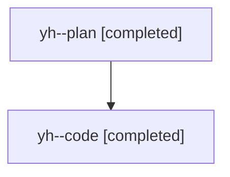

# Family: yh

[Agent Hoods](../README.md) / [bbugyi200](../users/bbugyi200/README.md) / [athena](../users/bbugyi200/machines/athena/README.md) / [yh](../users/bbugyi200/machines/athena/hoods/yh/README.md) / yh

Owner: `bbugyi200.athena` · Hood: `yh` · Members: 2

## Lineage

The diagram is an optional enhancement; the ordered table below contains the same lineage in accessible text.

| Role | Agent | State | Model / provider | Timing | Commits | Prompt | Chat |
|---|---|---|---|---|---:|---|---|
| plan | yh--plan | completed | opus / claude | 2026-08-12T13:39:34.398863+00:00 | 0 | [Prompt](../agents/bbugyi200.athena.yh--plan/prompt.md) | [Chat](../agents/bbugyi200.athena.yh--plan/chat.md) |
| code | yh--code | completed | sonnet / claude | 2026-08-12T13:48:51.772023+00:00 | [1](../agents/bbugyi200.athena.yh--code/README.md#commits) | — | [Chat](../agents/bbugyi200.athena.yh--code/chat.md) |

## Commits

| Role | Repo | Commit | Subject | Committed |
|---|---|---|---|---|
| code | sase | [`b129668`](https://github.com/sase-org/sase/commit/b12966834a29ad03fc06b587cb31c6381bcb8111) | fix(workspace-provider): stop #git: refs from clobbering non-bare-git projects | 2026-08-12 10:35:22 EDT |
