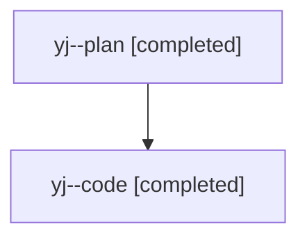

# Family: yj

[Agent Hoods](../README.md) / [bbugyi200](../users/bbugyi200/README.md) / [athena](../users/bbugyi200/machines/athena/README.md) / [yj](../users/bbugyi200/machines/athena/hoods/yj/README.md) / yj

Owner: `bbugyi200.athena` · Hood: `yj` · Members: 2

## Lineage

The diagram is an optional enhancement; the ordered table below contains the same lineage in accessible text.

| Role | Agent | State | Model / provider | Timing | Commits | Prompt | Chat |
|---|---|---|---|---|---:|---|---|
| plan | yj--plan | completed | opus / claude | 2026-08-12T14:38:25.812504+00:00 | 0 | [Prompt](../agents/bbugyi200.athena.yj--plan/prompt.md) | [Chat](../agents/bbugyi200.athena.yj--plan/chat.md) |
| code | yj--code | completed | gpt-5.5 / codex | 2026-08-12T14:49:00.200106+00:00 | [1](../agents/bbugyi200.athena.yj--code/README.md#commits) | — | [Chat](../agents/bbugyi200.athena.yj--code/chat.md) |

## Commits

| Role | Repo | Commit | Subject | Committed |
|---|---|---|---|---|
| code | sase | [`51996c5`](https://github.com/sase-org/sase/commit/51996c57e0ea657de3202489af924f2e19d7055d) | feat(bead): summarize bead list output | 2026-08-12 11:45:30 EDT |
