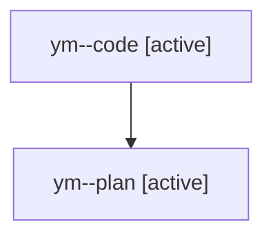

# Family: ym

[Agent Hoods](../README.md) / [bbugyi200](../users/bbugyi200/README.md) / [athena](../users/bbugyi200/machines/athena/README.md) / [ym](../users/bbugyi200/machines/athena/hoods/ym/README.md) / ym

Owner: `bbugyi200.athena` · Hood: `ym` · Members: 2

## Lineage

The diagram is an optional enhancement; the ordered table below contains the same lineage in accessible text.

| Role | Agent | State | Model / provider | Timing | Commits | Prompt | Chat |
|---|---|---|---|---|---:|---|---|
| code | ym--code | active | gpt-5.5 / codex | 2026-08-12T15:12:16.420137+00:00 | 0 | — | — |
| plan | ym--plan | active | opus / claude | 2026-08-12T14:59:45.531624+00:00 | 0 | [Prompt](../agents/bbugyi200.athena.ym--plan/prompt.md) | [Chat](../agents/bbugyi200.athena.ym--plan/chat.md) |
