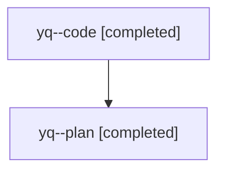

# Family: yq

[Agent Hoods](../README.md) / [bbugyi200](../users/bbugyi200/README.md) / [athena](../users/bbugyi200/machines/athena/README.md) / [yq](../users/bbugyi200/machines/athena/hoods/yq/README.md) / yq

Owner: `bbugyi200.athena` · Hood: `yq` · Members: 2

## Lineage

The diagram is an optional enhancement; the ordered table below contains the same lineage in accessible text.

| Role | Agent | State | Model / provider | Timing | Commits | Prompt | Chat |
|---|---|---|---|---|---:|---|---|
| code | yq--code | completed | sonnet / claude | 2026-08-12T16:34:35.053406+00:00 | [1](../agents/bbugyi200.athena.yq--code/README.md#commits) | — | [Chat](../agents/bbugyi200.athena.yq--code/chat.md) |
| plan | yq--plan | completed | opus / claude | 2026-08-12T16:23:27.016701+00:00 | 0 | [Prompt](../agents/bbugyi200.athena.yq--plan/prompt.md) | [Chat](../agents/bbugyi200.athena.yq--plan/chat.md) |

## Commits

| Role | Repo | Commit | Subject | Committed |
|---|---|---|---|---|
| code | sase | [`6b8c646`](https://github.com/sase-org/sase/commit/6b8c646c66892e133c86b08a3fa76920f0ec712f) | feat(commit)!: stage every change by default, replace -f/--file with -x/--exclude | 2026-08-12 13:21:12 EDT |
