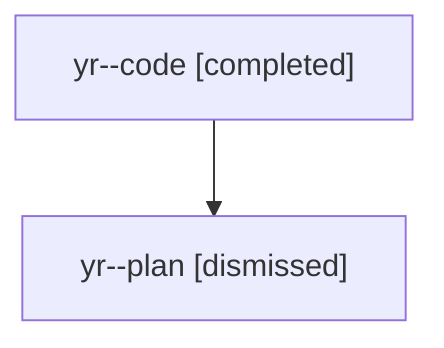

# Family: yr

[Agent Hoods](../README.md) / [bbugyi200](../users/bbugyi200/README.md) / [athena](../users/bbugyi200/machines/athena/README.md) / [yr](../users/bbugyi200/machines/athena/hoods/yr/README.md) / yr

Owner: `bbugyi200.athena` · Hood: `yr` · Members: 2

## Lineage

The diagram is an optional enhancement; the ordered table below contains the same lineage in accessible text.

| Role | Agent | State | Model / provider | Timing | Commits | Prompt | Chat |
|---|---|---|---|---|---:|---|---|
| code | yr--code | completed | sonnet / claude | 2026-08-12T17:16:27.054671+00:00 | [1](../agents/bbugyi200.athena.yr--code/README.md#commits) | — | [Chat](../agents/bbugyi200.athena.yr--code/chat.md) |
| plan | yr--plan | dismissed | opus / claude | 2026-08-12T12:59:39.686317 → 2026-08-12T13:52:32.980896 | 0 | — | [Chat](../agents/bbugyi200.athena.yr--plan/chat.md) |

## Commits

| Role | Repo | Commit | Subject | Committed |
|---|---|---|---|---|
| code | sase | [`42e60e5`](https://github.com/sase-org/sase/commit/42e60e5d6dd1eb91bcab6fb8d2fb8b3343b8c649) | fix(xprompts): put #sase/reads swarm agents in one reads-@ clan | 2026-08-12 13:44:58 EDT |
