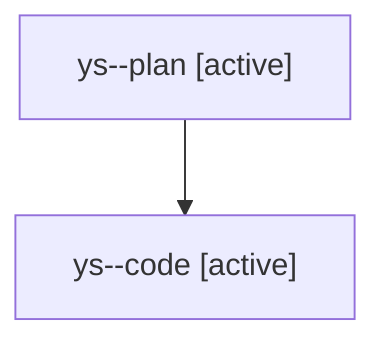

# Family: ys

[Agent Hoods](../README.md) / [bbugyi200](../users/bbugyi200/README.md) / [athena](../users/bbugyi200/machines/athena/README.md) / [ys](../users/bbugyi200/machines/athena/hoods/ys/README.md) / ys

Owner: `bbugyi200.athena` · Hood: `ys` · Members: 2

## Lineage

The diagram is an optional enhancement; the ordered table below contains the same lineage in accessible text.

| Role | Agent | State | Model / provider | Timing | Commits | Prompt | Chat |
|---|---|---|---|---|---:|---|---|
| plan | ys--plan | active | opus / claude | 2026-08-12T17:24:08.540115+00:00 | 0 | [Prompt](../agents/bbugyi200.athena.ys--plan/prompt.md) | [Chat](../agents/bbugyi200.athena.ys--plan/chat.md) |
| code | ys--code | active | gpt-5.5 / codex | 2026-08-12T17:31:14.963262+00:00 | [1](../agents/bbugyi200.athena.ys--code/README.md#commits) | — | — |

## Commits

| Role | Repo | Commit | Subject | Committed |
|---|---|---|---|---|
| code | sase | [`abc8a9e`](https://github.com/sase-org/sase/commit/abc8a9ea8a5b4c0a3188006fc72f932e8b876342) | feat(memory): move generated glossary to long memory | 2026-08-12 15:04:27 EDT |
