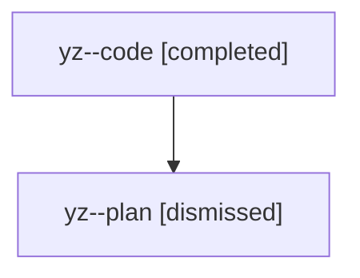

# Family: yz

[Agent Hoods](../README.md) / [bbugyi200](../users/bbugyi200/README.md) / [athena](../users/bbugyi200/machines/athena/README.md) / [yz](../users/bbugyi200/machines/athena/hoods/yz/README.md) / yz

Owner: `bbugyi200.athena` · Hood: `yz` · Members: 2

## Lineage

The diagram is an optional enhancement; the ordered table below contains the same lineage in accessible text.

| Role | Agent | State | Model / provider | Timing | Commits | Prompt | Chat |
|---|---|---|---|---|---:|---|---|
| code | yz--code | completed | sonnet / claude | 2026-08-12T21:28:15.615446+00:00 | [1](../agents/bbugyi200.athena.yz--code/README.md#commits) | — | [Chat](../agents/bbugyi200.athena.yz--code/chat.md) |
| plan | yz--plan | dismissed | opus / claude | 2026-08-12T17:06:59.655340 → 2026-08-12T17:44:39.548655 | 0 | — | [Chat](../agents/bbugyi200.athena.yz--plan/chat.md) |

## Commits

| Role | Repo | Commit | Subject | Committed |
|---|---|---|---|---|
| code | sase | [`2fb4313`](https://github.com/sase-org/sase/commit/2fb4313af7385e43b2d4788a0c809d622cdcd7b0) | fix(axe): close core-capability skew that killed agent\_runners startup | 2026-08-12 21:43:04 UTC |
