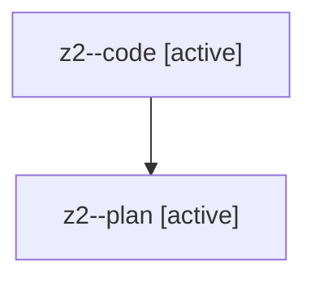

# Family: z2

[Agent Hoods](../README.md) / [bbugyi200](../users/bbugyi200/README.md) / [athena](../users/bbugyi200/machines/athena/README.md) / [z2](../users/bbugyi200/machines/athena/hoods/z2/README.md) / z2

Owner: `bbugyi200.athena` · Hood: `z2` · Members: 2

## Lineage

The diagram is an optional enhancement; the ordered table below contains the same lineage in accessible text.

| Role | Agent | State | Model / provider | Timing | Commits | Prompt | Chat |
|---|---|---|---|---|---:|---|---|
| code | z2--code | active | gpt-5.5 / codex | 2026-08-13T11:31:59.806179+00:00 | 0 | — | — |
| plan | z2--plan | active | opus / claude | 2026-08-13T11:26:59.436185+00:00 | 0 | [Prompt](../agents/bbugyi200.athena.z2--plan/prompt.md) | [Chat](../agents/bbugyi200.athena.z2--plan/chat.md) |
