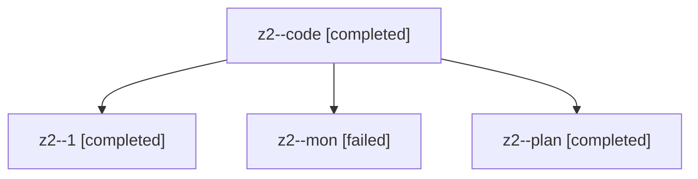

# Family: z2

[Agent Hoods](../README.md) / [bbugyi200](../users/bbugyi200/README.md) / [athena](../users/bbugyi200/machines/athena/README.md) / [z2](../users/bbugyi200/machines/athena/hoods/z2/README.md) / z2

Owner: `bbugyi200.athena` · Hood: `z2` · Members: 4

## Lineage

The diagram is an optional enhancement; the ordered table below contains the same lineage in accessible text.

| Role | Agent | State | Model / provider | Timing | Commits | Prompt | Chat |
|---|---|---|---|---|---:|---|---|
| code | z2--code | completed | gpt-5.5 / codex | 2026-08-13T11:31:59.806179+00:00 | [1](../agents/bbugyi200.athena.z2--code/README.md#commits) | — | [Chat](../agents/bbugyi200.athena.z2--code/chat.md) |
| 1 | z2--1 | completed | gpt-5.6-sol / codex | 2026-08-13T11:45:52.139838+00:00 | 0 | [Prompt](../agents/bbugyi200.athena.z2--1/prompt.md) | [Chat](../agents/bbugyi200.athena.z2--1/chat.md) |
| mon | z2--mon | failed | gpt-5.5 / codex | 2026-08-13T11:44:12.611186+00:00 | 0 | — | [Chat](../agents/bbugyi200.athena.z2--mon/chat.md) |
| plan | z2--plan | completed | opus / claude | 2026-08-13T11:26:59.436185+00:00 | 0 | [Prompt](../agents/bbugyi200.athena.z2--plan/prompt.md) | [Chat](../agents/bbugyi200.athena.z2--plan/chat.md) |

## Commits

| Role | Repo | Commit | Subject | Committed |
|---|---|---|---|---|
| code | sase | [`1928bd7`](https://github.com/sase-org/sase/commit/1928bd79866ce20998634c5707daddf86bde3aa1) | fix(ace): omit missing tribe description hint | 2026-08-13 07:44:55 EDT |
