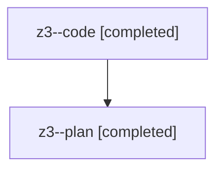

# Family: z3

[Agent Hoods](../README.md) / [bbugyi200](../users/bbugyi200/README.md) / [athena](../users/bbugyi200/machines/athena/README.md) / [z3](../users/bbugyi200/machines/athena/hoods/z3/README.md) / z3

Owner: `bbugyi200.athena` · Hood: `z3` · Members: 2

## Lineage

The diagram is an optional enhancement; the ordered table below contains the same lineage in accessible text.

| Role | Agent | State | Model / provider | Timing | Commits | Prompt | Chat |
|---|---|---|---|---|---:|---|---|
| code | z3--code | completed | gpt-5.5 / codex | 2026-08-13T11:46:27.381078+00:00 | [1](../agents/bbugyi200.athena.z3--code/README.md#commits) | — | [Chat](../agents/bbugyi200.athena.z3--code/chat.md) |
| plan | z3--plan | completed | opus / claude | 2026-08-13T11:38:10.283313+00:00 | 0 | [Prompt](../agents/bbugyi200.athena.z3--plan/prompt.md) | [Chat](../agents/bbugyi200.athena.z3--plan/chat.md) |

## Commits

| Role | Repo | Commit | Subject | Committed |
|---|---|---|---|---|
| code | sase | [`3e76e59`](https://github.com/sase-org/sase/commit/3e76e59fdb334c8cf374d2533d0f068d332fdd9e) | feat(memory): preserve multiline memory descriptions | 2026-08-13 08:15:40 EDT |
