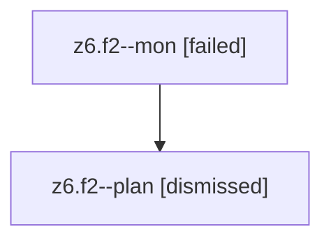

# Family: z6.f2

[Agent Hoods](../README.md) / [bbugyi200](../users/bbugyi200/README.md) / [athena](../users/bbugyi200/machines/athena/README.md) / [z6](../users/bbugyi200/machines/athena/hoods/z6/README.md) / z6.f2

Owner: `bbugyi200.athena` · Hood: `z6` · Members: 2

## Lineage

The diagram is an optional enhancement; the ordered table below contains the same lineage in accessible text.

| Role | Agent | State | Model / provider | Timing | Commits | Prompt | Chat |
|---|---|---|---|---|---:|---|---|
| mon | z6.f2--mon | failed | opus / claude | 2026-08-13T13:16:16.986741+00:00 | 0 | — | [Chat](../agents/bbugyi200.athena.z6.f2--mon/chat.md) |
| plan | z6.f2--plan | dismissed | opus / claude | 2026-08-13T09:04:45.682345 → 2026-08-13T09:16:07.856041 | 0 | — | — |

## Neighbors

| Agent | Relation | State |
|---|---|---|
| [z6](bbugyi200.athena.z6.md) (family · 2) | ancestor | completed 1, dismissed 1 |
| [z6.f0](../agents/bbugyi200.athena.z6.f0/README.md) | z6 hood | dismissed |
