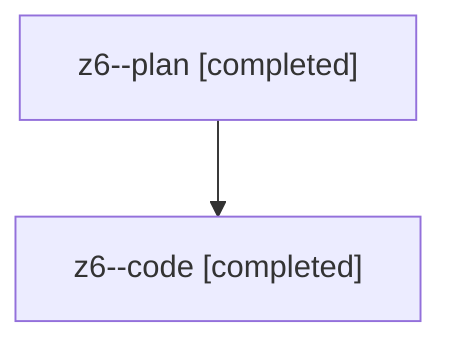

# Family: z6

[Agent Hoods](../README.md) / [bbugyi200](../users/bbugyi200/README.md) / [athena](../users/bbugyi200/machines/athena/README.md) / [z6](../users/bbugyi200/machines/athena/hoods/z6/README.md) / z6

Owner: `bbugyi200.athena` · Hood: `z6` · Members: 2

## Lineage

The diagram is an optional enhancement; the ordered table below contains the same lineage in accessible text.

| Role | Agent | State | Model / provider | Timing | Commits | Prompt | Chat |
|---|---|---|---|---|---:|---|---|
| plan | z6--plan | completed | opus / claude | 2026-08-13T12:08:57.352945+00:00 | 0 | [Prompt](../agents/bbugyi200.athena.z6--plan/prompt.md) | [Chat](../agents/bbugyi200.athena.z6--plan/chat.md) |
| code | z6--code | completed | sonnet / claude | 2026-08-13T12:15:48.200672+00:00 | [1](../agents/bbugyi200.athena.z6--code/README.md#commits) | — | [Chat](../agents/bbugyi200.athena.z6--code/chat.md) |

## Commits

| Role | Repo | Commit | Subject | Committed |
|---|---|---|---|---|
| code | sase | [`d04e8cf`](https://github.com/sase-org/sase/commit/d04e8cfcccef858fe526b50a56eba55e7d8faecd) | feat(ace): number Artifacts sub-tabs by visual order, Files highest | 2026-08-13 09:03:54 EDT |

## Neighbors

| Agent | Relation | State |
|---|---|---|
| [z6.f0](../agents/bbugyi200.athena.z6.f0/README.md) | descendant | dismissed |
| [z6.f2](bbugyi200.athena.z6.f2.md) (family · 2) | descendant | failed 2 |
