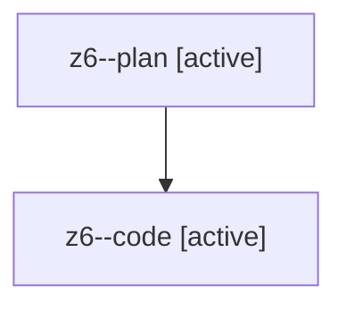

# Family: z6

[Agent Hoods](../README.md) / [bbugyi200](../users/bbugyi200/README.md) / [athena](../users/bbugyi200/machines/athena/README.md) / [z6](../users/bbugyi200/machines/athena/hoods/z6/README.md) / z6

Owner: `bbugyi200.athena` · Hood: `z6` · Members: 2

## Lineage

The diagram is an optional enhancement; the ordered table below contains the same lineage in accessible text.

| Role | Agent | State | Model / provider | Timing | Commits | Prompt | Chat |
|---|---|---|---|---|---:|---|---|
| plan | z6--plan | active | opus / claude | 2026-08-13T12:08:57.352945+00:00 | 0 | [Prompt](../agents/bbugyi200.athena.z6--plan/prompt.md) | [Chat](../agents/bbugyi200.athena.z6--plan/chat.md) |
| code | z6--code | active | sonnet / claude | 2026-08-13T12:15:48.200672+00:00 | 0 | — | — |

## Neighbors

| Agent | Relation | State |
|---|---|---|
| [z6.f0](../agents/bbugyi200.athena.z6.f0/README.md) | descendant | waiting |
