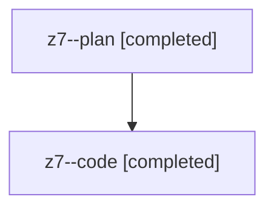

# Family: z7

[Agent Hoods](../README.md) / [bbugyi200](../users/bbugyi200/README.md) / [athena](../users/bbugyi200/machines/athena/README.md) / [z7](../users/bbugyi200/machines/athena/hoods/z7/README.md) / z7

Owner: `bbugyi200.athena` · Hood: `z7` · Members: 2

## Lineage

The diagram is an optional enhancement; the ordered table below contains the same lineage in accessible text.

| Role | Agent | State | Model / provider | Timing | Commits | Prompt | Chat |
|---|---|---|---|---|---:|---|---|
| plan | z7--plan | completed | opus / claude | 2026-08-13T12:15:40.081923+00:00 | 0 | [Prompt](../agents/bbugyi200.athena.z7--plan/prompt.md) | [Chat](../agents/bbugyi200.athena.z7--plan/chat.md) |
| code | z7--code | completed | gpt-5.5 / codex | 2026-08-13T12:29:25.608011+00:00 | [1](../agents/bbugyi200.athena.z7--code/README.md#commits) | — | [Chat](../agents/bbugyi200.athena.z7--code/chat.md) |

## Commits

| Role | Repo | Commit | Subject | Committed |
|---|---|---|---|---|
| code | sase | [`0dc9679`](https://github.com/sase-org/sase/commit/0dc9679949750bcd6d4affda3f8e8c192472d336) | fix(llm): route default launches through alias pools | 2026-08-13 08:58:14 EDT |
