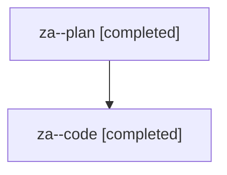

# Family: za

[Agent Hoods](../README.md) / [bbugyi200](../users/bbugyi200/README.md) / [athena](../users/bbugyi200/machines/athena/README.md) / [za](../users/bbugyi200/machines/athena/hoods/za/README.md) / za

Owner: `bbugyi200.athena` · Hood: `za` · Members: 2

## Lineage

The diagram is an optional enhancement; the ordered table below contains the same lineage in accessible text.

| Role | Agent | State | Model / provider | Timing | Commits | Prompt | Chat |
|---|---|---|---|---|---:|---|---|
| plan | za--plan | completed | opus / claude | 2026-08-13T12:56:06.966092+00:00 | 0 | [Prompt](../agents/bbugyi200.athena.za--plan/prompt.md) | [Chat](../agents/bbugyi200.athena.za--plan/chat.md) |
| code | za--code | completed | gpt-5.5 / codex | 2026-08-13T13:06:17.863151+00:00 | [1](../agents/bbugyi200.athena.za--code/README.md#commits) | — | [Chat](../agents/bbugyi200.athena.za--code/chat.md) |

## Commits

| Role | Repo | Commit | Subject | Committed |
|---|---|---|---|---|
| code | sase | [`829030f`](https://github.com/sase-org/sase/commit/829030f97434dd90eb8181f9842db0aa1b811665) | fix: satisfy lint gate audits | 2026-08-13 09:18:20 EDT |
